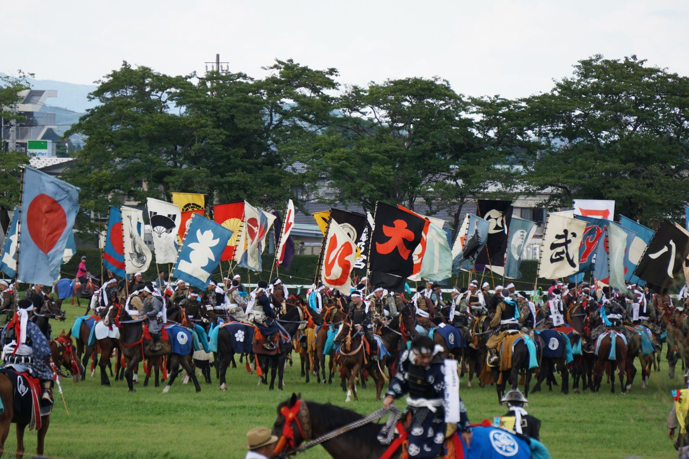

+++
title = "20190830_ja"
date = 2024-08-26T09:41:42-04:00
draft = false
featured_image = "imgs/feature.png"
featured_image_caption = "feature caption"

[params]
    paper_title = "Apollo News"
    actual_date = 2019-08-30
    issue_num = 1
+++



<!-- The main article should not be more than 740 characters -->


<h2>相馬野馬追</h2>


先月は相馬で行われる最大の祭り相馬野馬追がありました。２７日土曜日、相馬と小高と鹿島で行列が行われました。相双地区の住民が足軽や騎馬武者に仮装し、騎馬武者行列をしました。日曜日に騎馬戦と甲冑競馬がありました。日本中の人が相馬を訪れ相馬野馬追を楽しみました。一番人気のイベントは競馬でした。そのよる、小高では打ち上げ花火も催されました。月曜には小高で野馬懸というイベントがありました。野馬懸とは男性参加者が野馬を追いかけ縄をかけて捕まえるイベントです。男性たちはよく馬に蹴られるので、かなり危険なイベントです。多くの相馬市民は競馬と野馬懸をみたことがありません。機会があれば一度ごらんになてください。



{.feature-img}


<!-- a quarter article should not be more than 630 char -->
<h2>リビュー: 進撃の巨人</h2>

進撃の巨人を見て、最初に気がつくことは血とグロテスクな巨人です。巨人は歪で滑稽な印象を受けます。シーズン一の映像品質は高くてテレビというより映画のようです。話はね、話は変わっている。俺は、英語の字幕なしで日本語で見ている。ほとんど話が理解できていないです。アニメのキャラもわかっていないから大丈夫。文句をつけるとすれば、ほかのアニメのように話の進みがとても遅い。最近のエピソードは詰まらなくて他のことをしながら見ました。




## 便利なフレーズ
### 「なんだべ」

**意味:**「なんですか」もしくは「なんてこった」  
**使うとき:** わからないときとか、困ったとき  
**誰と使う:** 友達や家族  
**返し言葉:** 特にない 

**Example conversation:**  
パソコンがこわれた時に画面に向かって  
**りな:**   「なんだべ」  



{}
<!-- max number of difficult words is 10 -->
* dress up as ~
* ～に仮想する

* march
* 行進する

* strange
* 変な；歪

* quality  
* 質

* season
* 期；シーズン

* subtitles
* 字幕

* have no idea
* 全くわからない

* complaint
* 文句

* get bored
* 退屈する

* share
* 共有する

{}




{.feature-img-left}

{}

{}
<!-- a quarter article should not be more than 630 char -->
## Art Corner


{.art-img}
{}

{}
## Art Corner


{.art-img}

{}

{}
<!-- a quarter article should not be more than 630 char -->
## Puzzle

{.puzzle-img}
{}

{}
<!-- a quarter article should not be more than 630 char -->
## Riddle #1
パンはパンでも食べらないパンとはなんですか？
 
 
 
Answer:

<button class="spoiler">フライパン</button>
{}

{}
<!-- max number of difficult words is 10 -->
* greet
* 挨拶する 

* useful
* 便利な；有用な  

* wild
* 荒っぽい；野生

* phrase
* フレーズ

* pretty  
* かなり

* respond  
* 返事する；答える

* riddle
* 謎々

* bucks
* ドル

* recommend
* 勧める

* to suck at ~
* ～が下手

{}

