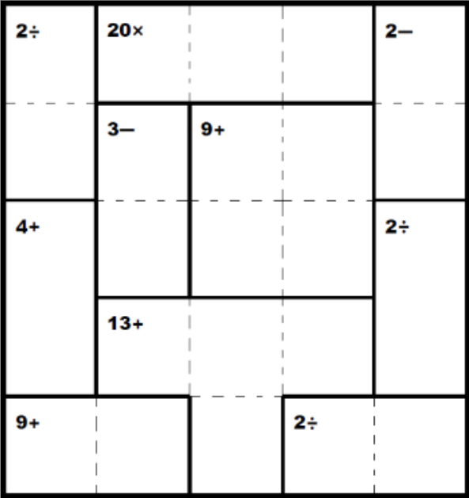
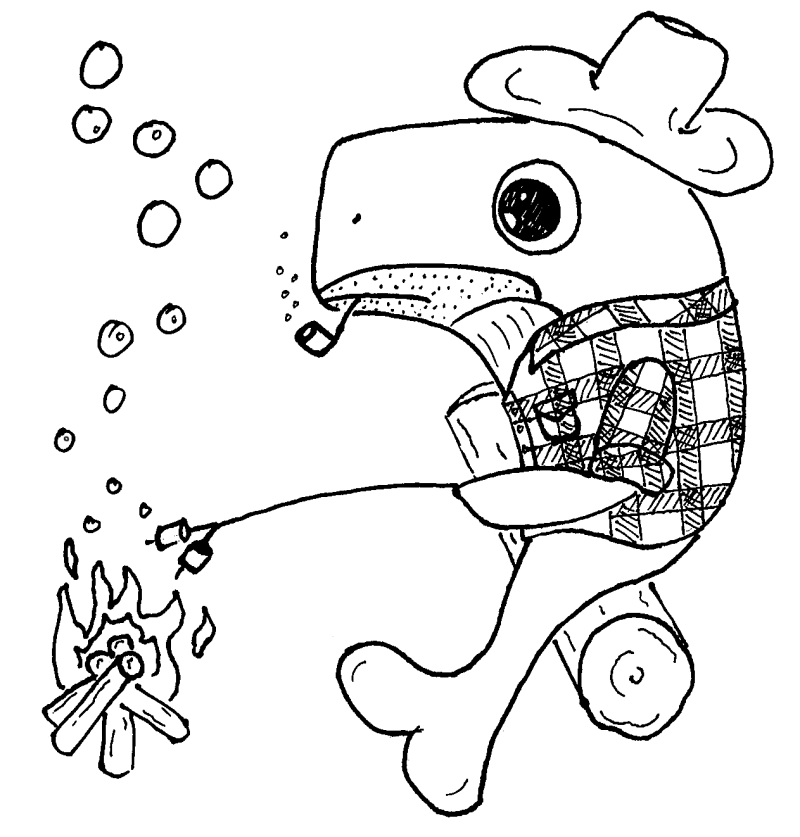

+++
title = "Issue #2 UN Climate Action Summit"
date = 2024-08-31T12:17:39-04:00
draft = false
featured_image = "imgs/feature.png"
featured_image_caption = "feature caption"

[params]
    paper_title = "Apollo News"
    actual_date = 2019-09-26
    issue_num = 2
+++

<!-- you can put percent signs on this instead of <> to process markdown -->



<!-- The main english article should not be more than 740 characters -->
<!-- The main japanese article should not be more than 350 characters -->


<h2>UN Climate Action Summit</h2>

Greta Thunberg gave a speech at the UN Climate Action Summit on September 23rd. She told world leaders that she was angry, she said, “You have stolen my dreams and my childhood with your empty words.”  Ms. Thunberg talked about climate change. She thinks that world leaders are not working to fix the problem.
   Ms. Thunberg is a 16 year old girl from Sweden who is worried about the future. She told the world leaders, “We are in the beginning of a mass extinction, and all you can talk about is money and fairy tales of eternal economic growth. How dare you!”
   Ms Thunberg and many young people believe that the damage to the climate that these countries are doing is a violation of their human rights. Students all over the world students are going on strike on September 27th to protest government inaction.


{.feature-img}


## Useful Phrase
### “What’s new?”

**Meaning:**「最近、何かあった？」や「かわったことは？」など  
**When to use:** When you greet someone  
**Who to use with:** Friends and family.  
**How to respond:** People usually say “Nothing.” or “Not much.”  
**Example conversation:**  
**Peter:** Hey Mary, what’s new?  
**Mary:** Nothing, how are you?  
**Peter:** I’m good.  



{}
<!-- a quarter article should not be more than 630 char -->
## Puzzle

{.puzzle-img}
{}

{}
<!-- max number of difficult words is 10 -->
* UN Climate Action Summit
* 国連の温暖化対策サミット
* world leaders
* 各国の代表
* stolen
* 盗まれた
* childhood
* 子供の時代
* empty words
* 空虚のことば
* fix
* 直す
* climate change
* 地球温暖化
* greet
* 挨拶する
* respond
* 返事する；答える
* conversation
* 会話

{}

<!-- END OF THE FIRST PAGE -->


<!-- -------------------------------------------------------- -->

<!-- ---------------- BEGINNING OF PAGE 2-------------------- -->

<!-- -------------------------------------------------------- -->



{.feature-img-left}

{}

{}
<!-- a quarter article should not be more than 600 char -->
## Art Corner


{.art-img}
{}


<!-- a quarter article should not be more than 600 char -->
<h2>Review: Hinomaru Sumo</h2>

There are so many high school sports animes. I usually don’t like them. A lot of sports anime are similar and they are often repetitive. I still watch them sometimes because they are easy to understand and it’s good Japanese practice.
Recently, I watched Hinomaru Sumo. The main character, Hinomaru Ushio, is a freshman in high school. He has dreams of becoming a professional sumo wrestler, even though he’s too short. 
Hinomaru Sumo is like other sports anime because all the characters have their own special skills. For example, Ozeki uses pushing and Yuma uses slapping. 
I like this anime because it's not as slow as other sports anime and I can learn a little bit about sumo.

<!-- Change the Ramen rating number to be the number out of five -->




{}
<!-- a quarter article should not be more than 630 char -->
## Riddle #2
How many months have 28 days?
 
 
 
  
  
  

Answer: <button class="spoiler">All of them</button>
{}

{}
<!-- max number of difficult words is 10 -->
* eternal economic growth
* 永遠の経済成長
* mass extinction
* 大絶滅
* how dare you
* よくもそなことを

* freshman
* 一年生
* similar
* 似ている
* repetitive
* ワンパターン
* even though ~
* ~のに
* skill
* 技
* pushing (in sumo)
* 押し出し
* slapping (in sumo)
* 張り手
{}

