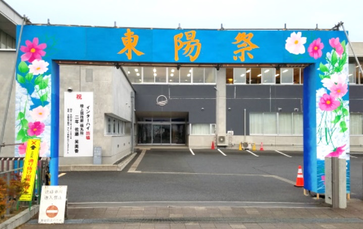
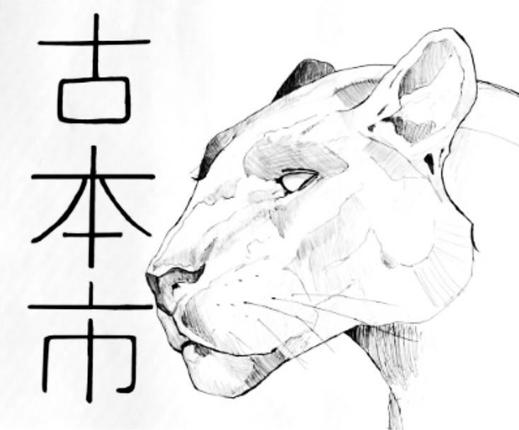
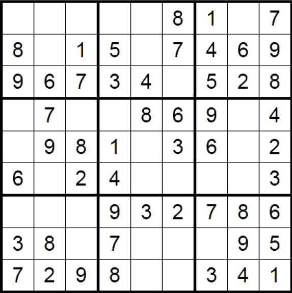
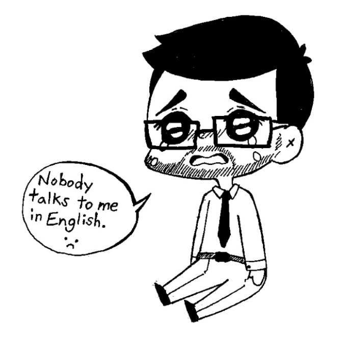

+++
title = "Issue #3 School Festivals"
date = 2024-09-02T02:22:59-04:00
draft = false
featured_image = "imgs/feature.jpg"
featured_image_caption = "Picture of School Festival"

[params]
    paper_title = "Apollo News"
    actual_date = 2019-10-07T02:22:59-04:00
    issue_num = 1
+++

<!-- you can put percent signs on this instead of <> to process markdown -->


<!-- The main english article should not be more than 740 characters -->
<!-- The main japanese article should not be more than 350 characters -->


<h2>School Festivals</h2>

日本の文化祭は一大イベントです。三年間に一回しか行われません。文化祭は公開されて様々なことが行われます。各教室は自分たちの出し物を考える。例えば、１－１だったらお化け屋敷、１－２はカフェで、１－３は縁日のゲーム、体育館では演奏を開かれます。文化祭に行ったら、
全部の教室を回ってそれぞれ違ったものを見ることができます。アメリカでの私の経験は違いました。高校でのイベントの一つは「メイデイ」でした。メイデイは体育祭と文化祭を合わせたようなもので、非公開で行われます。メイデイで各学年が競い合います。早食い競争やフラフープ競争、旗取りなどがありました。募金もありました。１５歳の時はチャリティー募金のために髪を剃られました。メイデイの準備はほとんど不要です。日本の文化祭は二日間で準備も数日間、そうして掃除は一日もかかります。メイデイと文化祭には多くの違いがあるけど、どっちも楽しいと思っています。



{.feature-img}

{}
<!-- a quarter article should not be more than 600 char -->
## Art Corner


{.art-img}
{}

{}
<!-- a quarter article should not be more than 600 char -->
## Puzzle: Sudoku

{.puzzle-img}
{}

{}
<!-- max number of difficult words is 10 -->
* big deal
* 一大
* once every three years
* 三年に一回
* open to the public
* 公開
* haunted house
* お化け屋敷
* carnival games
* 縁日のゲーム
* concert
* 演奏会

{}


<!-- -------------------------------------------------------- -->

<!-- ---------------- BEGINNING OF PAGE 2-------------------- -->

<!-- -------------------------------------------------------- -->



{}


<!-- a quarter article should not be more than 600 char -->
<h2>Review: Dragonball Z (Anime)</h2>

Dragonball Z is one of the most famous animes in the world. Everyone knows Dragonball Z. Even my mom knows Dragonball Z.
When I was in elementary school all of my friends were excited to watch the new episode of DBZ every week. Everyone saw Goku fight Cell and everyone saw Goku fight Frieza. 
Of my friends, I was the only one who didn’t like DBZ. I thought the fights were much too long. Goku vs Frieza was 20 episodes long! That’s over seven hours! One fight in Dragonball Z is longer than three movies. Dragonball Z has some fun characters and lots of manly yelling (in the English version) but it’s too long and that’s why I’m not a big fan.
<!-- Change the Ramen rating number to be the number out of five -->




{}
<!-- a quarter article should not be more than 600 char -->
## Art Corner


{.art-img}
{}

{}
<!-- a quarter article should not be more than 630 char -->
## Riddle #3
What has four legs and a back but no body?
 
 
 
Answer:
<button class="spoiler">A Chair</button>
{}

{}
<!-- max number of difficult words is 10 -->
* grades
* 学年
* raise money
* 金を調達する
* charity
* 慈善
* shaved
* 剃りました
* even my mom
* お母さんでさえも
* Of my friends~
* 私の友達のなかで～
* manly
* 男らしい
* yelling
* 怒鳴ること
* version
* 版
* not a big fan
* 特にファンじゃない

{}

