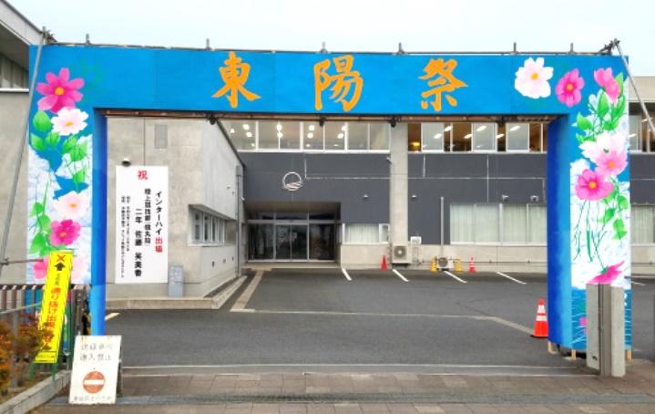
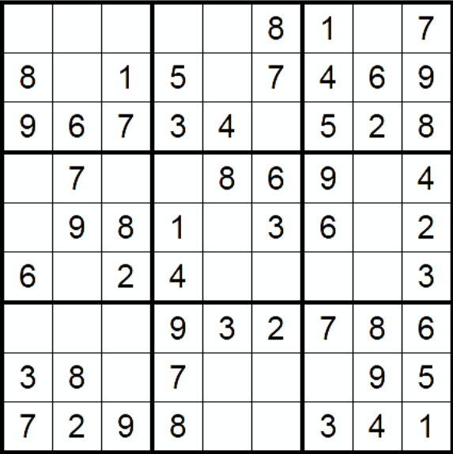
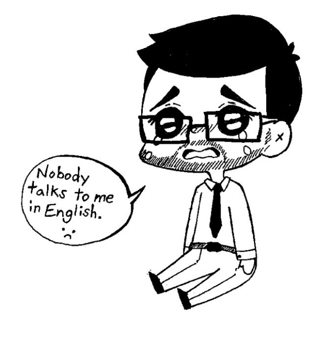

+++
title = "Issue #3 School Festivals"
date = 2024-09-02T02:22:59-04:00
draft = false
featured_image = "imgs/feature.jpg"
featured_image_caption = "Picture of School Festival"

[params]
    paper_title = "Apollo News"
    actual_date = 2019-10-07T02:22:59-04:00
    issue_num = 1
+++

<!-- you can put percent signs on this instead of <> to process markdown -->


<!-- The main english article should not be more than 740 characters -->
<!-- The main japanese article should not be more than 350 characters -->


<h2>School Festivals</h2>

School festivals in Japan are a big deal. They only happen once every three years. They are open to the public and have many different things going on. Each homeroom has their own project. For example, in the 1-1 homeroom they might have a haunted house, in 1-2, they might have a cafe, 1-3 might have carnival games, and there might be a concert in the gym. If you go to a school festival, you can go to all the classrooms and try all the different things.
In America, my experience was a little different. One of the events at my high school was Mayday. Mayday is like a mix of sports day and the school festivals in Japan, but it’s private. During Mayday, we would have competitions between grades. We would have eating competitions, hula hoop competitions and play capture the flag. We also tried to raise money for charities. I had my head shaved to raise money for charity when I was 15.
Mayday is a one day event with very little preparation. In Japan, a high school festival is two days, with a few days of preparation and a day of clean up. They are very different, but I think they’re both enjoyable.


{.feature-img}

{}
<!-- a quarter article should not be more than 600 char -->
## Art Corner


{.art-img}
{}

{}
<!-- a quarter article should not be more than 600 char -->
## Puzzle: Sudoku

{.puzzle-img}
{}

{}
<!-- max number of difficult words is 10 -->
* big deal
* 大したこと
* once every three years
* 三年で一回
* open to the public
* 公開
* haunted house
* お化け屋敷
* carnival games
* 縁日のゲーム
* concert
* 演奏会

{}


<!-- -------------------------------------------------------- -->

<!-- ---------------- BEGINNING OF PAGE 2-------------------- -->

<!-- -------------------------------------------------------- -->



{}


<!-- a quarter article should not be more than 600 char -->
<h2>Review: Dragonball Z (Anime)</h2>

Dragonball Z is one of the most famous animes in the world. Everyone knows Dragonball Z. Even my mom knows Dragonball Z.
When I was in elementary school all of my friends were excited to watch the new episode of DBZ every week. Everyone saw Goku fight Cell and everyone saw Goku fight Frieza. 
Of my friends, I was the only one who didn’t like DBZ. I thought the fights were much too long. Goku vs Frieza was 20 episodes long! That’s over seven hours! One fight in Dragonball Z is longer than three movies. Dragonball Z has some fun characters and lots of manly yelling (in the English version) but it’s too long and that’s why I’m not a big fan.
<!-- Change the Ramen rating number to be the number out of five -->




{}
<!-- a quarter article should not be more than 600 char -->
## Art Corner


{.art-img}
{}

{}
<!-- a quarter article should not be more than 630 char -->
## Riddle #3
What has four legs and a back but no body?
 
 
 
Answer:
<button class="spoiler">A Chair</button>
{}

{}
<!-- max number of difficult words is 10 -->
* grades
* 学年
* raise money
* 金を調達する
* charity
* 慈善
* shaved
* 剃りました
* even my mom
* お母さんでさえも
* Of my friends~
* 私の友達のなかで～
* manly
* 男らしい
* yelling
* 怒鳴ること
* version
* 版
* not a big fan
* 特にファンじゃない

{}

