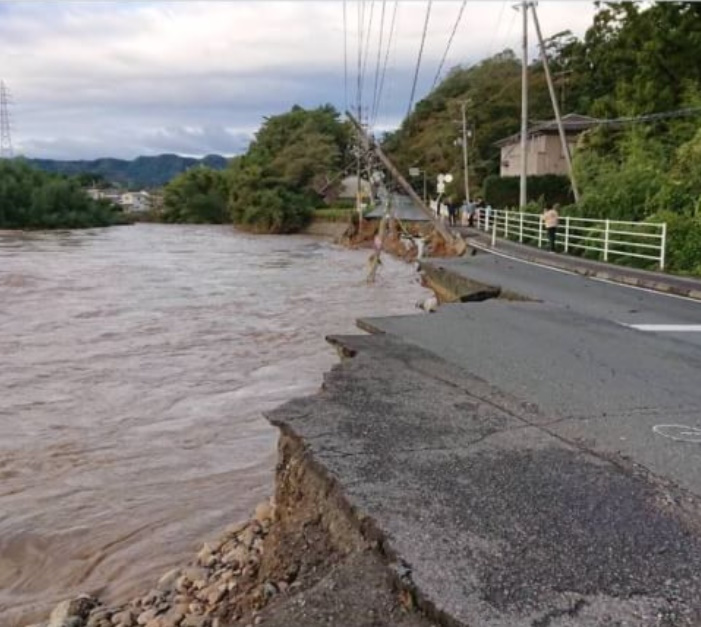
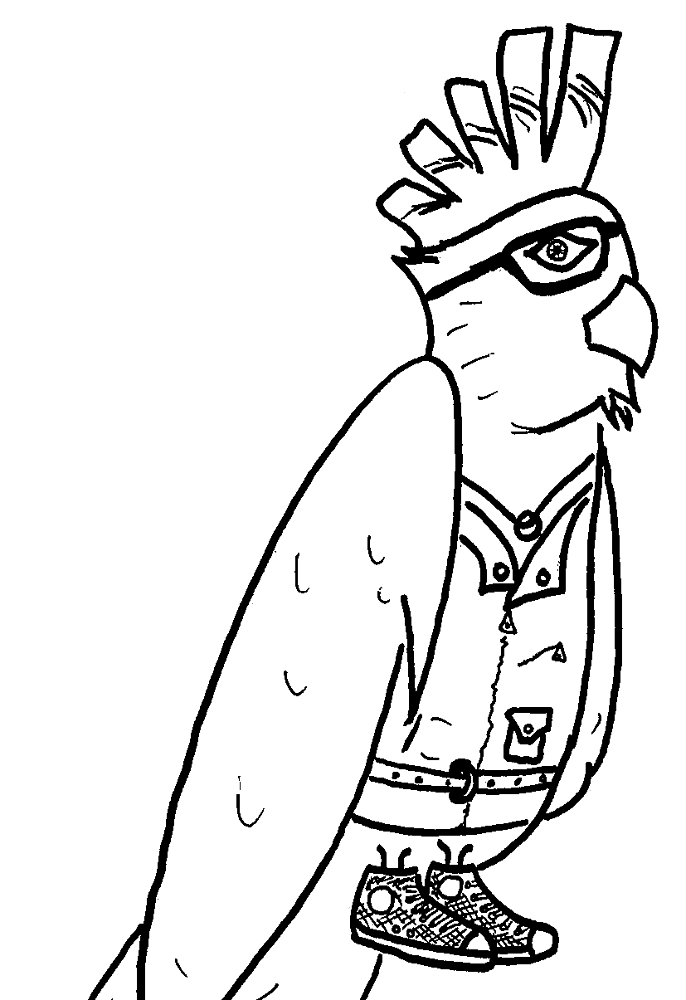
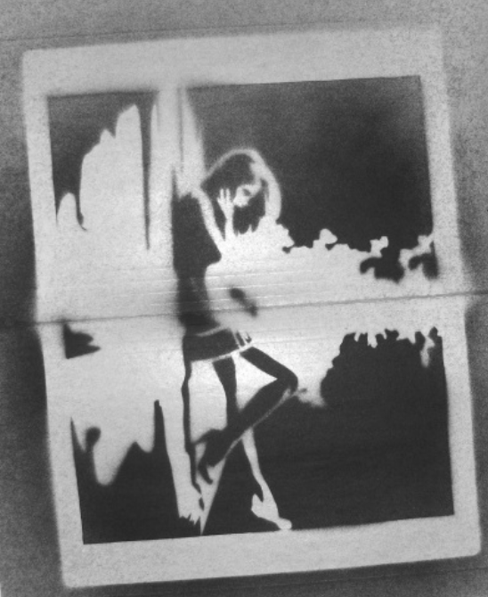

+++
title = "Issue #4: Flooding In Soma"
date = 2024-09-03T16:16:44-04:00
draft = false
featured_image = "imgs/feature.jpg"
featured_image_caption = "feature caption"

[params]
    paper_title = "Apollo News"
    actual_date = 2024-09-03T16:16:44-04:00
    issue_num = 1
+++

<!-- you can put percent signs on this instead of <> to process markdown -->



<!-- The main english article should not be more than 740 characters -->
<!-- The main japanese article should not be more than 350 characters -->

<h2> Flooding In Soma </h2>


On October 12th, Typhoon Hagibis (Typhoon 19) hit Japan. Flooding happened all over Soma. Both of the main rivers in Soma, Koizumi and Uta flooded. Around one quarter of the buildings in Soma flooded. Most of Soma lost water for one week. In the Soma area 21,000 people suffered from the water outage.  Only two weeks later there were heavy rains. The rains flooded more parts of the town. With the rains on the 25th and the typhoon on the 12th, a total of more than 3700 buildings were flooded. Now most of Soma is recovering but it will take a long time to be complete. 



{.feature-img}

{}
<!-- a quarter article should not be more than 600 char -->
## Art Corner


{.art-img}



{}
<!-- a quarter article should not be more than 600 char -->
## Art Corner


{.art-img}
{}

{}

## Riddle #4
Which word in the dictionary is spelled incorrectly? 
 
 
 
Answer: <button class="spoiler">incorrectly</button>
{}

{}
<!-- max number of difficult words is 10 -->

* flooding
* 浸水
* flooded
* 溢れた；浸水した
* one quarter
* ¼ ；四分の一
* lost water
* 断水した
* suffered from
* 苦しんだ
* water outage
* 断水
* heavy rains
* 大雨
* recovering
* 復旧してる
* damage
* 被害
* ~incorrectly
* 不正解に～

{}




{}
<!-- a quarter article should not be more than 600 char -->
<h2>Review: Black Thunders (Candy Bars)</h2>

I'm an expert at candy bars. So today, I’m going to tell you about the best-tasting and worst-tasting black thunder bars.

**THE GOOD:** Here are the five best black thunder bars. (From good to bad)
1. **Black Thunder: Gold Cafe**			-　Rating: 5/5  
This is a coffee flavor black thunder, with chocolate chunks. I love coffee and I love this black thunder.
2. **Black Thunder: Dark Matter**			-　Rating: 5/5  
Dark Matter is a bigger black thunder and is full of dark chocolate.  When these were available I would buy them every time I went to the convenience store.
3. **Black Thunder: Next Gear**			-　Rating: 4.5/5  
Next Gear is full of almonds to give you some protein and energy. It’s similar to the Dark Matter. It’s on sale now at various convenience stores.

**THE BAD:** Here are the five worst tasting Black Thunder bars (from bad to good)
1. **“Roasted Corn” (とうもろこし) Thunder**	- 　Rating: 0/5  
You shouldn’t put corn in a Black Thunder. It’s gross. Even after you finish eating it, the taste will stay in your mouth. Disgusting.
2. **“Mochi-Mochi” Black Thunder: Azuki**	- 　Rating: 1/5  
I don’t really like Azuki, but it’s even worse when you mix it with chocolate. Even if you find this Black Thunder, don’t try it.
3. **Black Thunder: Hojicha Latte**			-　Rating: 1.5/5  
This one is available now, but it’s not worth 30 yen. If you want to have a special black thunder that’s available now, try the Morning Black Thunder (朝専用).

{}

{}
<!-- max number of difficult words is 10 -->
* expert
* 名人
* best-tasting
* 一番美味しい
* worst-tasting
* 一番不味い
* flavor
* 味
* chunks
* チャンク
* available
* 販売中
* protein
* タンパク
* various
* 様々な
* gross / disgusting
* きもい・気持ち悪い
* worth
* 値する

{}

