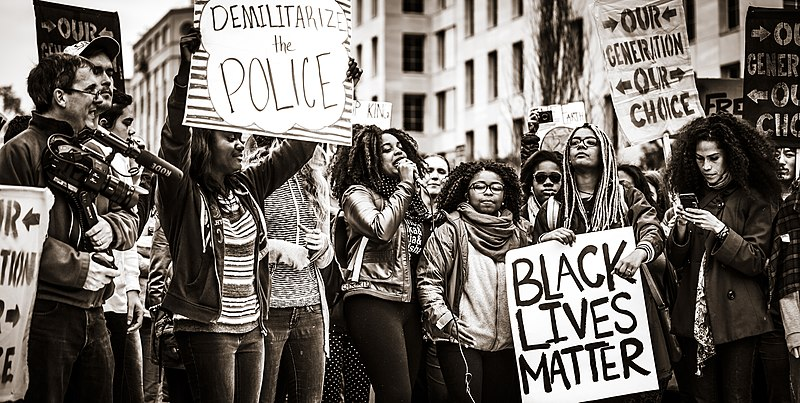

+++
title = "Issue #6: Protests"
date = 2024-09-15T01:31:03-04:00
draft = true
featured_image = "imgs/feature.png"
featured_image_caption = "feature caption"

[params]
    paper_title = "Apollo News"
    actual_date = 2024-09-15T01:31:03-04:00
    issue_num = 1
+++

<!-- you can put percent signs on this instead of <> to process markdown -->



<!-- The main english article should not be more than 740 characters -->
<!-- The main japanese article should not be more than 350 characters -->

<h2> Protest </h2>

On May 25th 2020, George Floyd, a 46-year-old black man was killed by the police in Minneapolis, USA. In the USA, police are often violent especially to minorities.  After that people protested in the USA. The protests grew bigger and bigger. Soon people around the world were protesting. In America, some of the protests became violent. Police attacked the protesters and the protesters destroyed buildings.  In the past there have been similar protests. In 2014, Michael Brown,  a black 18-year-old was killed by the police in Ferguson, USA and there were protests all over the US. This time the protests are even bigger. Now, many things are happening in the USA. The coronavirus is spreading. The US has the most cases of coronavirus in the world. Because of this, many people are unemployed and many people saw the video of George Floyd’s death. They have also seen videos of the police attacking protesters. People see these videos and then they join the protests. Now, the protests continue and the police continue to arrest many protestors. Over 9,000 protesters have been arrested. Do you want to know more? You can read more on the website of the Associated Press.


{.feature-img}


<!-- a quarter article should not be more than 600 char -->
<h2>Review: UFO Catcher Games</h2>

I hate UFO Catcher games. I think they are terrible. I don’t think they should even be called games. It should be called gambling. Or maybe a scam. Many of the games cost 100 yen per play and you need to play at least ten times to win. I don’t want to pay 1000 yen for a stuffed animal that is worth 200 yen. That’s crazy! 
<!-- Change the Ramen rating number to be the number out of five -->




{}
## Useful Phrase
### “Can I help at all?” / “Can I help?”

**Meaning:**「手伝いますか？」など
**When to use:** When you want to help someone
**Who to use with:** Anyone. Someone who is lost or needs help carrying something.
**How to respond:** People usually say “Yes, please” or “No, thank you.”

**Example conversation:**  
**Mary:** Hey, can I help?
**Peter:** Sure, please carry this bag
**Mary:**  Ok!

{}

{}
<!-- max number of difficult words is 10 -->

* black man
* 黒人の男
* protesters
* デモ参加者
* violent
* 乱暴な・激烈な
* similar
* 似たような
* especially
* 特に
* carrying
* 手に持っている
* minorities
* 少数派
* respond
* 返事する
* protested
* デモした・抗議した
* face
* 面している（向き）

{}


<!-- -------------------------------------------------------- -->
<!-- ---------------- BEGINNING OF PAGE 2-------------------- -->
<!-- -------------------------------------------------------- -->


{.feature-img-left}

{}

{}
<!-- a quarter article should not be more than 600 char -->
## Art Corner


{.art-img}
{}

{}
<!-- a quarter article should not be more than 600 char -->
## Art Corner


{.art-img}

{}

{}
<!-- a quarter article should not be more than 630 char -->
## Riddle #6

What goes up and down without moving?
   
Answer: 

<button class="spoiler">stairs</button>
{}

{}
<!-- max number of difficult words is 10 -->
* happening
* 起こっている
* unemployed
* 無職
* terrible
* ひどい
* gambling
* 博打
* scam
* 詐欺
* at least
* 少なくても
* stuffed animal
* ぬいぐるみ
* worth
* 価値がる

{}

