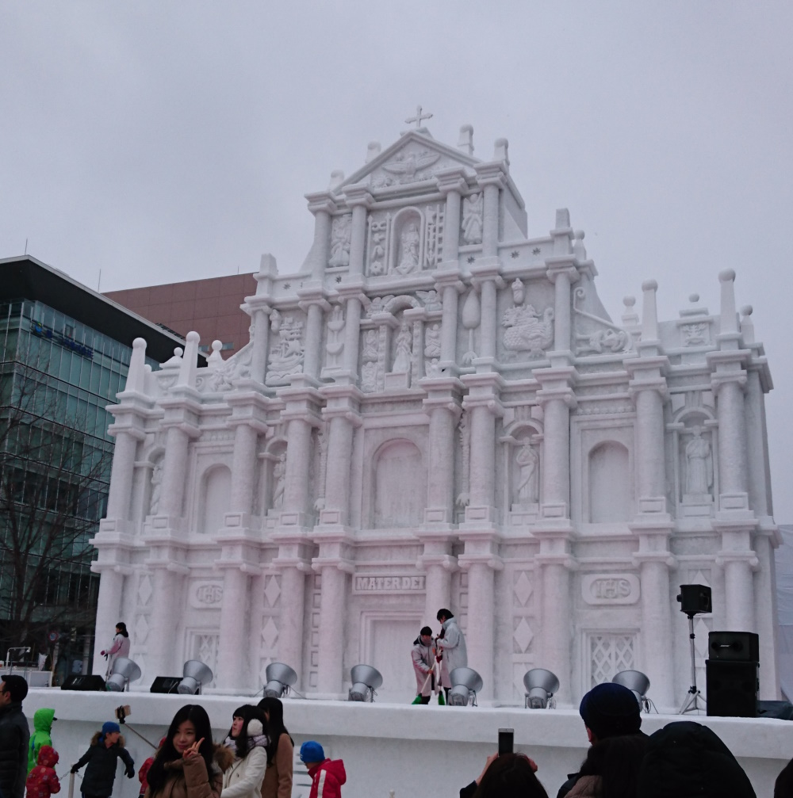
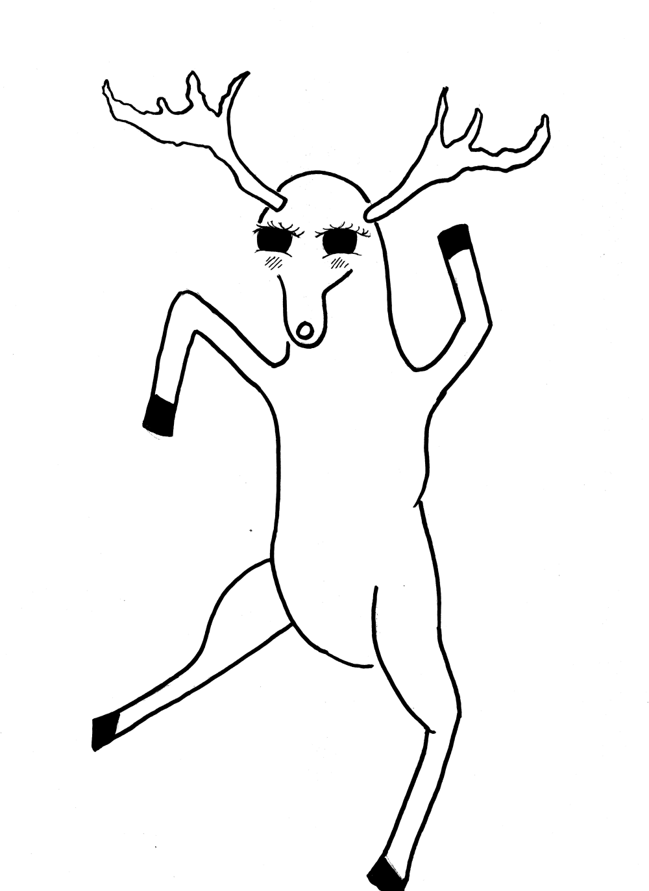
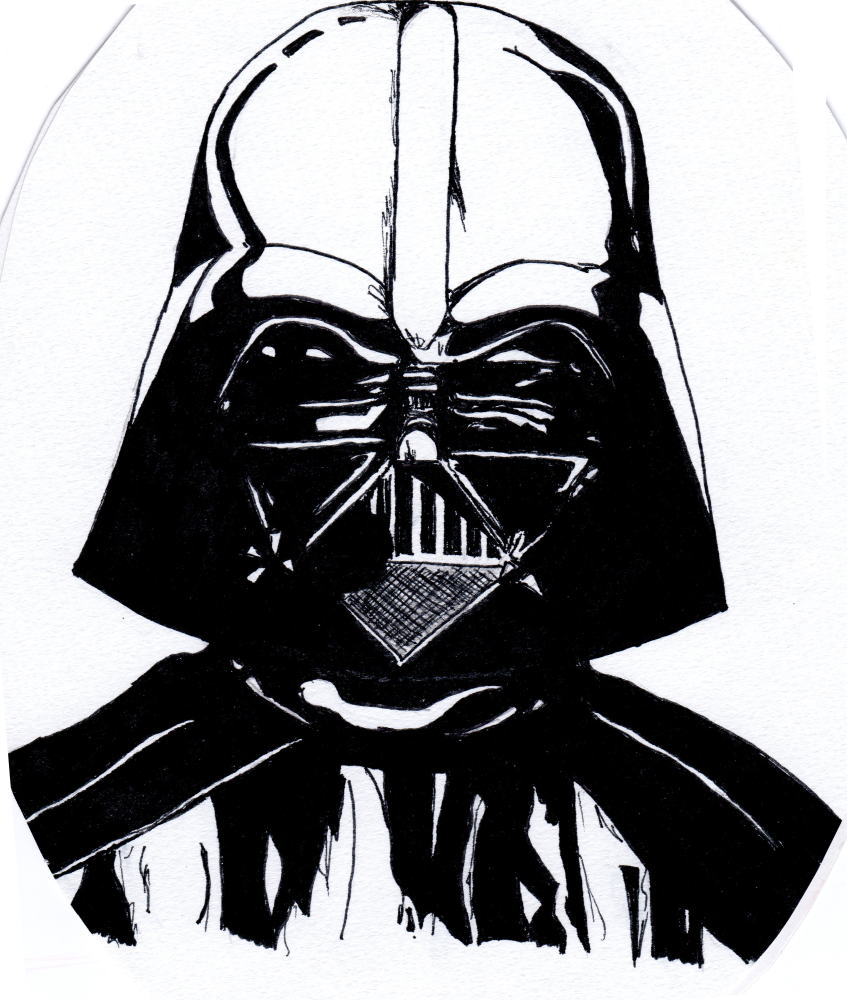
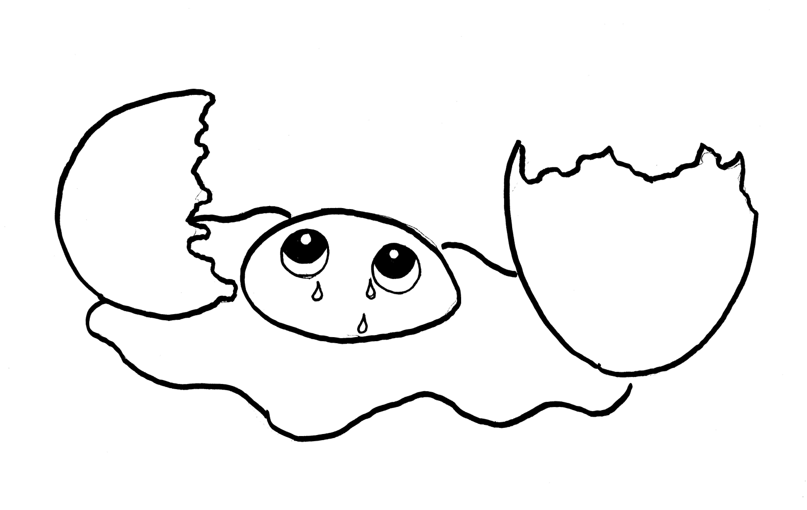

+++
title = "Issue #7: Yuki Matsuri"
date = 2024-10-02T22:20:49-04:00
draft = true
featured_image = "imgs/feature.jpg"
featured_image_caption = "feature caption"

[params]
    paper_title = "Apollo News"
    actual_date = 2024-10-02T22:20:49-04:00
    issue_num = 1
+++

<!-- you can put percent signs on this instead of <> to process markdown -->



<!-- The main english article should not be more than 740 characters -->
<!-- The main japanese article should not be more than 350 characters -->

<h2> Sapporo Yuki Matsuri (Snow Festival) </h2>

Unfortunately, this year the snow festival in Sapporo was canceled because of COVID-19. Luckily, I went to the festival twice when I lived in Japan. The festival started in 1950 with six snow sculptures and now has hundreds of snow and ice sculptures. Some of the snow sculptures are so big that they are used as stages for performances. Famous people or things are often the theme. One year I went it theme was Osamu Tezuka (creator of Mighty Atom / Astro Boy). Another year it was the 30th anniversary of Dragonball. So much snow is used in the festival that the Self-Defense Force often helps by bringing snow from far away to be used in the sculptures and they make some snow sculptures. Here's a list of some events at the snow festival:

<ul>
    <li>Snow and Ice sculptures</li>
    <li>Live music on snow stages</li>
    <li>Ice skating and sledding</li>
    <li>Festival food from around the world</li>
    <li>Snowboard and skiing jumps and tricks</li>
</ul>


{.feature-img}

{}
<!-- a quarter article should not be more than 600 char -->
## Art Corner


{.art-img}

{}


<!-- a quarter article should not be more than 600 char -->
<h2>Review:  Yotsuba&! よつばと！</h2>

I’m still learning Japanese and sometimes it’s frustrating to read a difficult book. Difficult books can be very slow to read and sometimes I want to read something easy. Yotsuba&! is an easy to read manga for someone learning Japanese. Yotsuba&! is about a five year old girl who is learning about the world. She is excited about everything. The author, Kiyohiko Azuma, wrote the manga with the motto “Enjoy Everything”.  This motto is shown in every chapter of Yotsuba&!, anyone can read this book and be reminded of the innocence and joy of being a child.
<!-- Change the Ramen rating number to be the number out of five -->




{}
<!-- max number of difficult words is 10 -->

* unfortunately
* あいにくに
* was canceled
* 中止された
* twice
* 二回
* when I lived in Japan
* 日本に住んだ時
* snow and ice sculptures
* 雪像や氷像
* stages
* 舞台
* performances
* 演奏
* anniversary
* 記念
* creator of
* ～の作者
* Self-Defense Force
* 自衛隊

{}


<!-- -------------------------------------------------------- -->
<!-- ---------------- BEGINNING OF PAGE 2-------------------- -->
<!-- -------------------------------------------------------- -->


{.feature-img-left}

{}

{}
<!-- a quarter article should not be more than 600 char -->
## Art Corner


{.art-img}
{}

{}
<!-- a quarter article should not be more than 600 char -->
## Art Corner


{.art-img}
{}
{}
<!-- a quarter article should not be more than 630 char -->
## Riddle #7
What can you catch but not throw?
   
Answer:

<button class="spoiler">a cold</button>
{}

{}
<!-- max number of difficult words is 10 -->
* sledding and tubing
* 橇やチューブライダー
* jumps and tricks
* ジャンプや技
* frustrating to read
* 読むのは悔しい
* easy to read
* 読みやすい
* motto
* 標語；モットー
* be reminded of ~
* ～を思い出す；思い浮かべる
* innocence
* 純粋さ；無邪気
* joy of being a child
* 子供の幸福

{}

